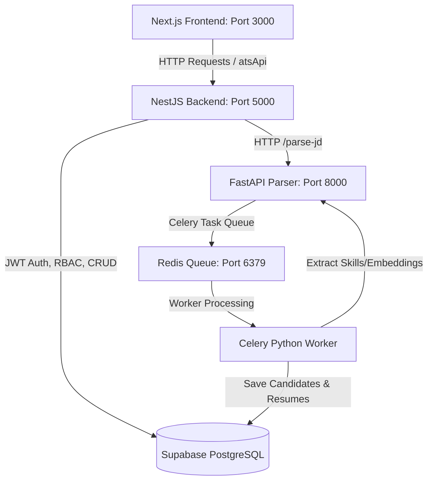

# PROJECT ARCHITECTURE BLUEPRINT - ATS ENFY

This document serves as the **Information Architecture (IA) & Codebase Map** for the multi-tenant Applicant Tracking System (ATS). It is designed to be read first by AI Agents / LLMs in a session to instantly understand the system structure, conventions, and dependencies.

---

## 1. System Topology & Data Flow

---

## 2. Directory & Component Breakdown

### A. Frontend: Next.js 14 App Router (`ats_frontend_main/`)
* **State & Authentication:** NextAuth.js session-based state provider.
* **Master API Client:** [ats-api.ts](file:///c:/Users/enfyc/OneDrive/Desktop/ATS%20enfy/ats_frontend_main/lib/ats-api.ts) — The single point of contact for HTTP requests to `/api/*` on NestJS backend.
* **Layouts & Sidebar:** Managed by `components/layout/app-sidebar.tsx` and [navigation.ts](file:///c:/Users/enfyc/OneDrive/Desktop/ATS%20enfy/ats_frontend_main/constants/navigation.ts).
* **Core Pages:**
  - **All Jobs Dashboard:** [job-posting-dashboard.tsx](file:///c:/Users/enfyc/OneDrive/Desktop/ATS%20enfy/ats_frontend_main/app/%28dashboard%29/job-posting/components/job-posting-dashboard.tsx) / [data-table.tsx](file:///c:/Users/enfyc/OneDrive/Desktop/ATS%20enfy/ats_frontend_main/app/%28dashboard%29/job-posting/components/data-table.tsx)
  - **New Job Form & AI Parser:** [new/page.tsx](file:///c:/Users/enfyc/OneDrive/Desktop/ATS%20enfy/ats_frontend_main/app/%28dashboard%29/job-posting/new/page.tsx)
  - **Unified Requisition Details & Pipeline Tracker:** [job-posting/[id]/page.tsx](file:///c:/Users/enfyc/OneDrive/Desktop/ATS%20enfy/ats_frontend_main/app/%28dashboard%29/job-posting/[id]/page.tsx) (Kanban + Candidate Search + AI Match tracker tabs)
  - **Submissions & Recruiter Feedback tracker:** [submissions/page.tsx](file:///c:/Users/enfyc/OneDrive/Desktop/ATS%20enfy/ats_frontend_main/app/%28dashboard%29/utility/submissions/page.tsx)
  - **Roles and Permissions Settings Page:** [roles-permissions/page.tsx](file:///c:/Users/enfyc/OneDrive/Desktop/ATS%20enfy/ats_frontend_main/app/%28dashboard%29/utility/roles-permissions/page.tsx)

### B. Backend: NestJS Core (`ats_backend/`)
* **Database Connection:** Driven by SQL query building (`src/jobs/`, `src/candidates/`, `src/auth/` modules).
* **Guards & Roles:** `JwtAuthGuard` + `PermissionsGuard` verify JWT headers and match user permission requirements (e.g. `@RequirePermissions('job:create')`).
* **Tenant Identification:** Custom middleware grabs `x-tenant-id` header or token subdomain, resolving all DB queries strictly within the corresponding workspace boundary.

### C. AI Resume & JD Parser: FastAPI (`resume-parser-main/`)
* **Natural Language Processing:** Built on `spaCy` using Custom Entity Matching rules in [parser.py](file:///c:/Users/enfyc/OneDrive/Desktop/ATS%20enfy/resume-parser-main/app/parser.py).
* **AI Fallback Refinement:** Google Gemini 2.5 Flash model handles complex/messy paragraphs to build highly accurate candidate/JD profiles.
* **Skill Normalization:** Processes raw skill strings against a database-backed master skill alias hash map loaded into RAM on startup in [normalizer.py](file:///c:/Users/enfyc/OneDrive/Desktop/ATS%20enfy/resume-parser-main/app/normalizer.py).
* **Celery Worker:** Enqueues PDF/DOCX resume file parsing asynchronously, storing parsed data and text embeddings inside Supabase PostgreSQL.

---

## 3. Core Architectural Concepts & Business Logic

### Multi-Tenancy (Subdomains & Workspace Isolation)
- Subdomain strings (e.g., `deb.localhost:3000` -> tenant `deb`) are parsed dynamically by [subdomain-helper.ts](file:///c:/Users/enfyc/OneDrive/Desktop/ATS%20enfy/ats_frontend_main/utils/subdomain-helper.ts).
- Backend enforces tenant isolation via the `tenant_id` database column constraint on tables `jobs`, `candidates`, `submissions`, and `clients`.

### Pod Assignment System vs. Unassigned Requisitions
- **Auto Mapping (Pod System enabled):** New job postings are assigned to recruiter pods automatically using round-robin logic.
- **Normal Flow (Pod System disabled):** Requisitions go into a shared pool.
- **Security Constraint:** Requisitions marked as **Unassigned** (not bound to a pod) can **only** be modified/assigned by `DELIVERY_HEAD` accounts or administrators. Attempting to assign recruiters on unassigned jobs by general recruiters/pod leads triggers an immediate database exception.
- **Cross-Pod Assignment Restrictions:** Recruiters cannot be mapped to jobs managed by another pod (Cross-Pod overlap) unless done by a `DELIVERY_HEAD` or higher administrator role.

### Recruiter Screening & Submission Approval Workflow
1. **Screening Submission:** Recruiters submit candidates with screen notes. The submission status defaults to `PENDING_APPROVAL` (Internal Review phase).
2. **Zone A (Internal Review):** Account Managers (AMs) or Pod Leads view recruiter notes, write manager review feedback (saved in database column `review_feedback`), and click **Approve** or **Reject**.
3. **Zone B (Client Submission & Interviews):** Approved candidates enter the active client pipeline, enabling AMs/Managers to track Interview rounds (L1, L2, L3) and final placement parameters. Recruiters have read-only access to Zone B.

### Safe Archiving Over Destruction
- **Action Mapping:** Clicking the red Trash/Delete buttons triggers an `Archived` status update payload on the database. Archived jobs are filtered out of main active requirements but remain discoverable in filters.

### Indian Staffing Customizations
- **Form UI Adaptation:** When `market === "IN"` is active (or set via dynamic default from profile):
  1. The label `"Tax Terms"` is renamed to `"Engagement Type"`, and options are loaded with localized staffing terms (`Permanent / Direct Hire`, `Contract (3rd Party Payroll)`, `Contract (Direct Payroll)`, `C2H`, `Freelancer / Consultant`).
  2. The US-centric `"Required Hours/Week"` field is hidden, and in its place, a `"Shift Timings"` dropdown select is rendered (`General Shift`, `Night Shift`, `Rotational Shift`, `UK/EMEA Shift`).
  3. For `"Permanent / Direct Hire"` engagement type, the standard "Client Bill Rate" fields are replaced by a `"Client Commission (%)"` dropdown with presets (`8.33%`, `10.0%`, `12.5%`, `15.0%`) and a custom numeric percent option.
- **Data Integration:** To avoid database migrations:
  - `shiftTiming` is prepended to the top of the job description as a stylized HTML block (`
<strong>Shift Timing:</strong> ...
`) on form submit, and parsed back out on edit loading.
  - The permanent placement commission is stored directly in the `clientBillRate` string column (e.g. `8.33% Placement Commission` or `11.5% Placement Commission`), and is parsed back into commissionType/customCommission form states when loading the edit view.

