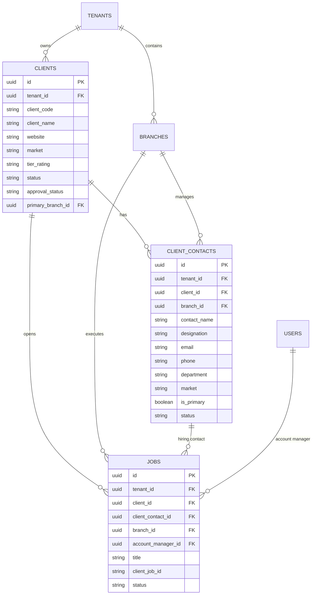

# Enterprise Client CRM & Multi-Contact Architecture Guide

## 1. Executive Summary & Domain Modeling

In multi-branch recruitment and staffing agencies, a Client Account (e.g., *Google, Microsoft, TCS, Deloitte*) represents a **Tenant-Wide Master Asset**, while operational interactions (Hiring Managers, VMS Coordinators, Billing Entities) are **Branch-Specific Relationships**.

### Core Principles
1. **Unified Master Entity**: Client naming, master contracts (MSAs), credit vetting, and corporate domains are unified tenant-wide to prevent CRM data fragmentation.
2. **1-to-Many Dynamic POC Hierarchy**: Each client can have multiple Points of Contact (POCs) categorized by branch, department, and market (India Domestic vs. US IT).
3. **Branch-Scoped Ownership**: Account Managers from Branch A and Branch B maintain their own client relationships, local rate cards, and POC address books independently.

---

## 2. Entity Relationship Diagram (ERD)



---

## 3. Database Schema Blueprint

### 3.1. `clients` (Master Table Enhancements)
```sql
CREATE TABLE IF NOT EXISTS clients (
    id UUID PRIMARY KEY DEFAULT gen_random_uuid(),
    tenant_id UUID NOT NULL REFERENCES tenants(id) ON DELETE CASCADE,
    client_code VARCHAR(50) NOT NULL,
    client_name VARCHAR(255) NOT NULL,
    end_client_name VARCHAR(255),
    is_same_as_primary BOOLEAN DEFAULT true,
    website VARCHAR(255),
    industry VARCHAR(100),
    market VARCHAR(50) DEFAULT 'INDIA', -- 'INDIA', 'US', 'GLOBAL'
    tier_rating VARCHAR(50) DEFAULT 'TIER_1',
    status VARCHAR(50) DEFAULT 'Active', -- 'Active', 'Pending Approval', 'Inactive', 'Rejected'
    approval_status VARCHAR(50) DEFAULT 'APPROVED', -- 'APPROVED', 'PENDING_APPROVAL', 'REJECTED'
    primary_branch_id UUID REFERENCES branches(id) ON DELETE SET NULL,
    created_by UUID REFERENCES users(id),
    approved_by VARCHAR(255),
    approved_at TIMESTAMP WITH TIME ZONE,
    rejection_reason TEXT,
    created_at TIMESTAMP WITH TIME ZONE DEFAULT NOW(),
    updated_at TIMESTAMP WITH TIME ZONE DEFAULT NOW(),
    deleted_at TIMESTAMP WITH TIME ZONE,
    CONSTRAINT uq_tenant_client_code UNIQUE (tenant_id, client_code),
    CONSTRAINT uq_tenant_client_name UNIQUE (tenant_id, client_name)
);

CREATE INDEX idx_clients_tenant_status ON clients (tenant_id, status, deleted_at);
CREATE INDEX idx_clients_market ON clients (tenant_id, market);
```

### 3.2. `client_contacts` (Branch-Aware Multiple POCs)
```sql
CREATE TABLE IF NOT EXISTS client_contacts (
    id UUID PRIMARY KEY DEFAULT gen_random_uuid(),
    tenant_id UUID NOT NULL REFERENCES tenants(id) ON DELETE CASCADE,
    client_id UUID NOT NULL REFERENCES clients(id) ON DELETE CASCADE,
    branch_id UUID REFERENCES branches(id) ON DELETE SET NULL,
    contact_name VARCHAR(255) NOT NULL,
    designation VARCHAR(150),
    email VARCHAR(255),
    phone VARCHAR(50),
    mobile VARCHAR(50),
    department VARCHAR(100), -- e.g. "Cloud & AI", "HR & University Relations", "VMS Procurement"
    market VARCHAR(50) DEFAULT 'INDIA', -- 'INDIA', 'US'
    is_primary BOOLEAN DEFAULT false,
    notes TEXT,
    created_by UUID REFERENCES users(id),
    created_at TIMESTAMP WITH TIME ZONE DEFAULT NOW(),
    updated_at TIMESTAMP WITH TIME ZONE DEFAULT NOW(),
    deleted_at TIMESTAMP WITH TIME ZONE
);

CREATE INDEX idx_client_contacts_lookup ON client_contacts (tenant_id, client_id, branch_id);
```

---

## 4. API Endpoints & Business Logic

### 4.1. Client Contacts Management API

| Method | Endpoint | Description | Access Clearance |
|---|---|---|---|
| `GET` | `/clients/:id/contacts` | List all POCs for a client (filtered by caller branch / market) | `client:view` |
| `POST` | `/clients/:id/contacts` | Add a new branch-specific POC | `client:create` or `client:edit` |
| `PUT` | `/clients/contacts/:contactId` | Update contact details | `client:edit` |
| `DELETE` | `/clients/contacts/:contactId` | Soft-delete a contact | `client:edit` |

### 4.2. Smart POC Filtering Query (Job Creation Flow)
When an Account Manager at `branch_id = X` creates a job for `client_id = Y`:
```sql
SELECT id, contact_name, designation, email, phone, department, is_primary
FROM client_contacts
WHERE tenant_id = $tenantId
  AND client_id = $clientId
  AND (branch_id = $userBranchId OR branch_id IS NULL)
  AND deleted_at IS NULL
ORDER BY (branch_id = $userBranchId) DESC, is_primary DESC, contact_name ASC;
```

---

## 5. UI/UX Workflow & Component Specification

### 5.1. Client Details Hub (`/clients/[id]`)
- **Master Header**: Shows Client Name, Market (`🇮🇳 India` or `🇺🇸 USA`), Tier Badge, and Master Status.
- **Contacts & POCs Tab**:
  - Displays contact cards grouped by Branch / Location.
  - **Quick Action**: "+ Add New Contact / Hiring Manager" with Branch tag.
  - Shows direct communication links (Email, Phone, WhatsApp).

### 5.2. Job Creation Dropdown Integration (`/job-posting/new`)
1. User selects **Client**: `Google`
2. **POC Dropdown** automatically updates to list:
   - *Priya Sharma (HR Lead - Bangalore Branch) [Primary]*
   - *Ramesh Kumar (Engineering Director - Bangalore Branch)*
   - *+ Add New POC on the Fly*
3. Form auto-fills the POC work email and phone numbers for candidate interview dispatch.
