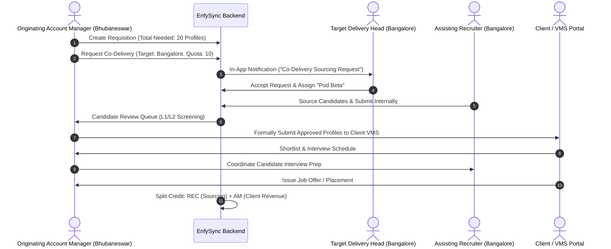

# Cross-Branch Collaborative Job Management & Co-Delivery Guide

## 1. System Overview & Problem Statement

In multi-branch staffing organizations, high-volume requisitions (e.g., *20 Fullstack Developers for TCS in 5 days*) often exceed the sourcing capacity of a single office branch. 

### Key Business Requirements
1. **Zero Duplicate Requisitions**: Branches must never create separate duplicate job posts for the same client requirement.
2. **Controlled Delegation (Co-Delivery)**: The owning branch can formally delegate specific sourcing quotas to assisting branches.
3. **Single Point of Client Contact**: The originating Account Manager retains 100% exclusive authority over client communication and rate negotiation.
4. **Transparent Placement Attribution**: Sourcing recruiters from assisting branches receive commission credit, while the originating Account Manager receives client account revenue credit.

---

## 2. Co-Delivery Architecture & Workflow



---

## 3. Database Schema Blueprint

### 3.1. `job_co_deliveries` Table
```sql
CREATE TABLE IF NOT EXISTS job_co_deliveries (
    id UUID PRIMARY KEY DEFAULT gen_random_uuid(),
    tenant_id UUID NOT NULL REFERENCES tenants(id) ON DELETE CASCADE,
    job_id UUID NOT NULL REFERENCES jobs(id) ON DELETE CASCADE,
    origin_branch_id UUID NOT NULL REFERENCES branches(id),
    target_branch_id UUID NOT NULL REFERENCES branches(id),
    target_pod_id UUID REFERENCES pods(id) ON DELETE SET NULL,
    requested_by UUID NOT NULL REFERENCES users(id),
    accepted_by UUID REFERENCES users(id),
    status VARCHAR(30) DEFAULT 'PENDING', -- 'PENDING', 'ACCEPTED', 'DECLINED', 'COMPLETED'
    quota_profiles INT NOT NULL DEFAULT 5,
    submitted_count INT DEFAULT 0,
    placed_count INT DEFAULT 0,
    priority VARCHAR(20) DEFAULT 'HIGH', -- 'URGENT', 'HIGH', 'NORMAL'
    instructions TEXT,
    deadline_date DATE,
    created_at TIMESTAMP WITH TIME ZONE DEFAULT NOW(),
    updated_at TIMESTAMP WITH TIME ZONE DEFAULT NOW()
);

CREATE INDEX idx_job_co_delivery_target ON job_co_deliveries (tenant_id, target_branch_id, status);
CREATE INDEX idx_job_co_delivery_job ON job_co_deliveries (job_id, status);
```

### 3.2. Submissions Schema Tagging
In `submissions` table, record both sourcing and owning lineage:
```sql
ALTER TABLE submissions 
    ADD COLUMN IF NOT EXISTS sourcing_branch_id UUID REFERENCES branches(id),
    ADD COLUMN IF NOT EXISTS originating_branch_id UUID REFERENCES branches(id),
    ADD COLUMN IF NOT EXISTS co_delivery_id UUID REFERENCES job_co_deliveries(id);
```

---

## 4. Cross-Branch Duplicate Job Detection Engine

To prevent multiple branches from posting overlapping jobs in the same market without authorization:

### 4.1. Fast 3-Step Deduplication Algorithm

$$\text{Match Score} = (0.5 \times \text{Title Similarity}) + (0.3 \times \text{Skill Overlap}) + (0.2 \times \text{Location Match})$$

```typescript
// Sub-millisecond PostgreSQL Query in jobs.service.ts
async function checkDuplicateRequisition(tenantId: string, market: string, clientId: string, title: string, clientJobId?: string) {
  // 1. Exact VMS / Client Job ID Match (Hard Block)
  if (clientJobId && clientJobId !== 'N/A') {
    const exact = await db.query(
      `SELECT j.id, j.job_code, j.title, b.name as branch_name, u.full_name as owner_name 
       FROM jobs j 
       JOIN branches b ON b.id = j.branch_id
       LEFT JOIN users u ON u.id = j.account_manager_id
       WHERE j.tenant_id = $1 AND j.client_id = $2 AND LOWER(j.client_job_id) = LOWER($3)
         AND j.status IN ('Active', 'Open', 'Published', 'Draft', 'Pending Approval')
         AND j.deleted_at IS NULL LIMIT 1`,
      [tenantId, clientId, clientJobId]
    );
    if (exact.rows.length > 0) return { isDuplicate: true, type: 'EXACT_VMS', match: exact.rows[0] };
  }

  // 2. Intra-Market Fuzzy Match (Last 60 Days)
  const fuzzy = await db.query(
    `SELECT j.id, j.job_code, j.title, b.name as branch_name, similarity(j.title, $4) as score
     FROM jobs j
     JOIN branches b ON b.id = j.branch_id
     WHERE j.tenant_id = $1 AND j.market = $2 AND j.client_id = $3
       AND j.status IN ('Active', 'Open', 'Published')
       AND j.created_at >= NOW() - INTERVAL '60 days'
       AND similarity(j.title, $4) > 0.70
     ORDER BY score DESC LIMIT 1`,
    [tenantId, market, clientId, title]
  );
  if (fuzzy.rows.length > 0) return { isDuplicate: true, type: 'FUZZY_TITLE', match: fuzzy.rows[0] };

  return { isDuplicate: false };
}
```

---

## 5. Client Governance & Communication Boundaries

| Workflow Step | Owning Branch (Origin) | Assisting Branch (Co-Delivery) |
|---|---|---|
| **Direct Client Contact** | ✅ Exclusive access | ❌ Blocked |
| **VMS Portal Login** | ✅ Submits profiles | ❌ Internal submission only |
| **Bill Rate Negotiation** | ✅ Sets commercial margins | ❌ Adheres to candidate pay ceiling |
| **Internal Candidate Screening** | ✅ Gatekeeper audit approval | ✅ Pre-screens & submits CV |
| **Candidate RTR (Right-to-Represent)** | ✅ Verifies single representation | ✅ Obtains candidate consent |
| **Placement Billing** | ✅ Invoices client | ❌ Handled via internal split |

---

## 6. Implementation Roadmap & Milestones

1. **Sprint 1: Schema & Backend Services**
   - Create `job_co_deliveries` migration and API routes (`POST /jobs/:id/delegate`, `GET /jobs/co-deliveries`, `PUT /jobs/co-deliveries/:id/status`).
   - Implement `checkDuplicateRequisition` with `pg_trgm` GIN index.
2. **Sprint 2: UI Modals & Badge Indicators**
   - Add "Collaborate Sourcing" modal on `/job-posting/[id]`.
   - Add Co-Delivery status badges in Job Table and Recruiter Dashboard.
3. **Sprint 3: Notifications & Analytics**
   - Add real-time in-app notifications for Delivery Heads.
   - Cross-branch co-delivery fulfillment reports on `/reports`.
